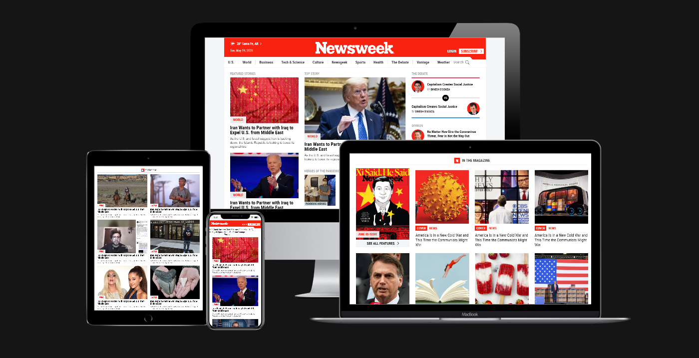

# Using Bootstrap

> Build a replica of the news site Newsweek.com using the Bootstrap framework.

Original project specification at: https://www.theodinproject.com/courses/html5-and-css3/lessons/using-bootstrap

## Built With

- HTML,
- CSS,
- Bootstrap v4.1

## Live Demo

To check how the page works follow [this](https://raw.githack.com/Bismarck-GM/Microverse-Using-Bootstrap/development/index.html) link!

### Usage

If you want to run it locally just download all the files and open index.html

## Author

👤 **Gerónimo Morisot**

- Github: [@Bismarck-GM](https://github.com/Bismarck-GM)
- Twitter: [@Rewritablee](https://twitter.com/Rewritablee)
- Linkedin: [Gerónimo Morisot](https://linkedin.com/in/geronimomorisot)

## 🤝 Contributing

Contributions, issues and feature requests are welcome!

Feel free to check the [issues page](issues/).

## Show your support

Give a ⭐️ if you like this project!

## 📝 License

This project is [MIT](lic.url) licensed.
